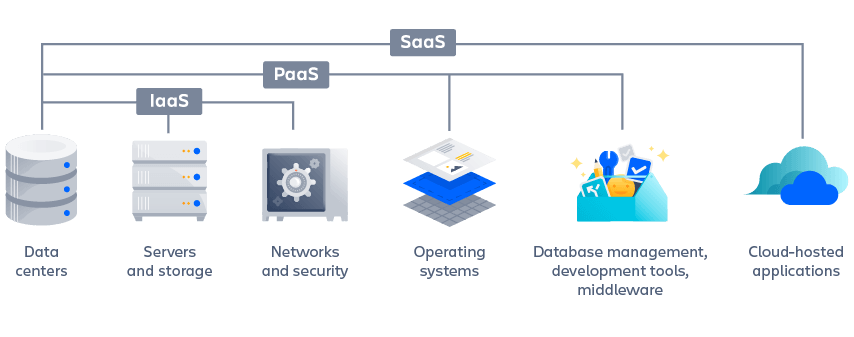

# Cloud Computing

Cloud computing is the delivery of computing resources — including storage, processing power, databases, networking, analytics, artificial intelligence, and software applications — over the internet (the cloud). By outsourcing these resources, companies can access the computational assets they need, when they need them, without needing to purchase and maintain a physical, on-premise IT infrastructure. This provides flexible resources, faster innovation, and economies of scale.

## Characteristics of cloud computing

• **On-demand self service** - Cloud computing providers offer APIs that users access to requisition new resources or scale existing resources whenever needed. Teams can automate their infrastructure provisioning in a simple way with infrastructure as code tools from the likes of Terraform and Ansible.

• **Broad network access** - Physical hardware location is a significant concern when delivering the optimal end-user experience. Cloud computing provides a huge boon by offering globally-distributed physical hardware, which allows organizations to strategically provision location-targeted hardware.

• **Resource pooling** - Computing resources in a cloud infrastructure platform are dynamically divided and allocated on demand. Since a cloud host’s physical machines are dynamically provisioned and shared between multiple tenants, cloud hardware is thoroughly optimized for maximum usage.

• **Rapid elasticity** - Cloud infrastructures can grow and shrink dynamically, allowing users to request that their computational resources auto-scale with traffic demands. Elasticity can happen on a per-machine basis, where an allocation of resources grows to maximize the available machine resources, or multi-machine basis, in which an application automatically scales to multi-networked machines.

• **Measured service** - Cloud infrastructure providers give detailed usage metrics that are used to communicate usage costs. For example, Amazon Web Services (AWS) provides usage for each service category in hourly or daily line items. Cloud service providers generally take a utility style pay-as-you-go billing model that is measured and delivered, so customers are charged for the exact amount of computing
resources used.

## Types of cloud deployments

There are three primary types of cloud deployments. Each has unique benefits and organizations often benefit from using more than one.

!!! abstract "Public cloud"
    Deliver computing resources -- servers, storage, applications, etc. -- over the internet from a cloud service provider, such as AWS and Microsoft Azure. Cloud providers own and operate all hardware, software, and other supporting infrastructure.

!!! info "Private cloud"
    A private cloud is computing resources dedicated exclusively to an organization. It can be physically located at an organization’s on-site data center, or hosted by a cloud provider. A private cloud delivers a higher level of security and privacy than public clouds by offering dedicated resources to companies.

    Private cloud customers get the primary benefits of a public cloud, including self-service, scalability, and elasticity, but with the added benefit of additional control and customization. Plus, private clouds can have a higher level of security and privacy because they are housed on private networks not accessible to public traffic.

!!! tip "Hybrid cloud"
    Combination of private and public clouds (for example, IBM Hybrid Cloud, powered by Red Hat), connected together with technology that enables data and application to work together. Sensitive services and applications can be kept in the secure private cloud while publicly-accessible web servers and customer-facing endpoints can live in the public cloud. Most popular third-party cloud providers offer a hybrid cloud model, allowing users to combine private and public clouds to satisfy their needs. This allows businesses greater flexibility to deploy the specific infrastructure requirements of their application.

## Cloud computing services

The dynamic properties of cloud computing set the foundation for higher-level services that are essential for agile and DevOps teams.

The main categories are:

1. **Infrastructure as a Service (IaaS)** - A foundational cloud service layer that allows organizations to rent IT infrastructure -- servers, storage, networks, operating systems -- from a cloud provider. IaaS lets users reserve and provision the resources they need out of raw physical server warehouses. In addition, IaaS lets users reserve pre-configured machines for specialized tasks like load balancers, databases, email servers, distributed queues.

    !!! tip "Usage"
        DevOps teams can use IaaS as an underlying platform from which to build a DevOps toolchain, which can include the use of various third-party tools.

2. **Platform as a Service (PaaS)** - PaaS is built on IaaS and provides resources to build user-level tools and applications. It includes compute, network, and storage resources, as well as development tools, database management systems, and middleware.

    PaaS automatically allocates resources for popular tech stacks (e.g., Ruby on Rails, Java Spring MVC, MEAN, JAM).

    !!! tip "Usage"
        Teams can upload application code artifacts that are automatically deployed, allowing them to focus on business logic rather than infrastructure. PaaS handles scaling and monitoring based on traffic loads.    

3. **Software as a Service (SaaS)** - SaaS delivers software applications over the internet, typically on-demand and by subscription. Providers host and manage the application, including upgrades and security patching.

4. **Function as a Service (FaaS)** - FaaS offers a platform for customers to develop, run, and manage applications without maintaining infrastructure. Cloud providers execute code blocks, return results, and then destroy the resources used. This model enables rapid development and deployment of event-driven applications.
