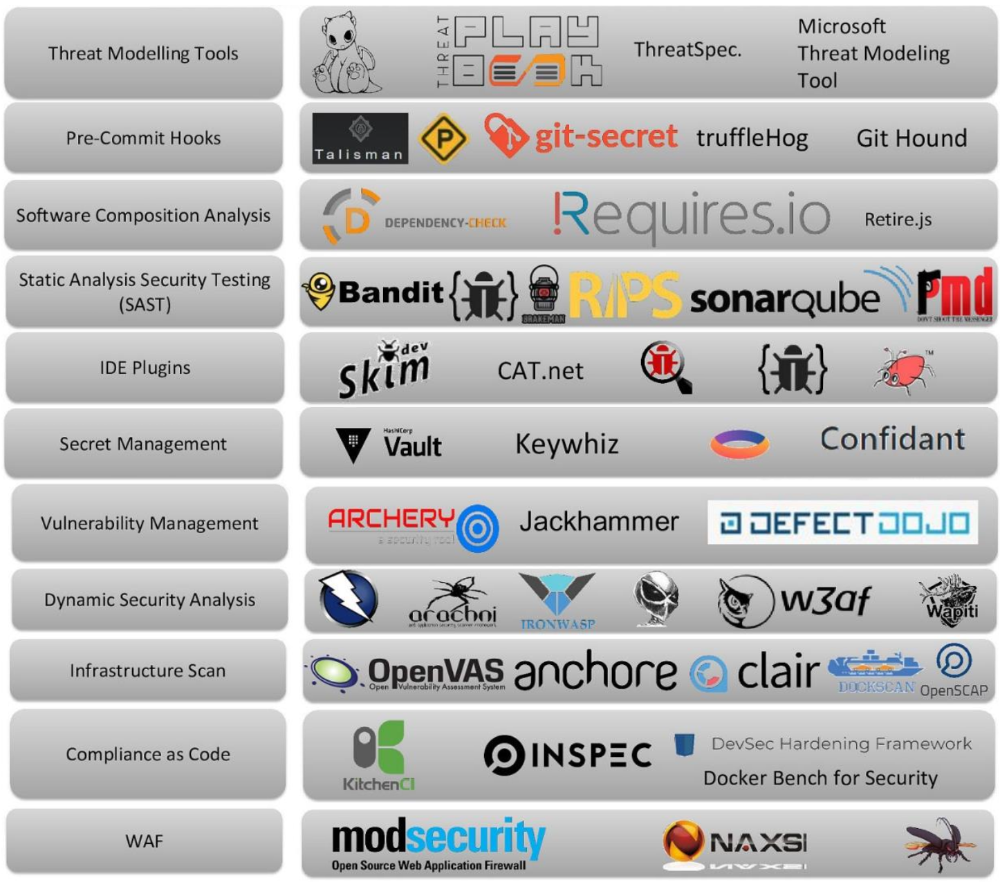

# Other concepts

This section overviews Agile & Scrum, SRE, DevSecOps, Platform Engineering and Cloud Engineering.

## Agile

Agile is an iterative approach to project management and software development that focuses on collaboration, customer feedback, and rapid releases. It arose in the early 2000s from the software development industry, helping development teams react and adapt to changing market conditions and
customer demands.

In an agile approach, some planning and design is done upfront, but the development proceeds in small batches and involves close collaboration with stakeholders. Changes are incorporated continuously and a usable version of a product is often released quicker compared to products developed through the waterfall methodology. This provides many benefits, with arguably the most important being that if software doesn’t meet the needs or expectations of the customer, it can be remediated in real-time.

Agile is a collection of methodologies, not a single approach to development. It is an aggregation of scrum, eXtreme Programming (XP), and other systems of practice that developers used in years prior, and resulted from those practitioners coming together to unify these approaches into a single set of principles. The result of this unification effort was the Agile Manifesto, which consists of 12 principles, based on four core values:

!!! info "The Agile Manifesto’s four core values"
    1. Individuals and interactions - over processes and tools
    2. Working software - over comprehensive documentation
    3. Customer collaboration - over contract negotiation
    4. Responding to change - over following a plan

!!! quote "Agile Principles"

    **The values are based on these principles:**

    1. Customer satisfaction by early and continuous delivery of valuable software.
    2. Welcome changing requirements, even in late development.
    3. Deliver working software frequently (weeks rather than months).
    4. Close, daily cooperation between business people and developers.
    5. Projects are built around motivated individuals, who should be trusted.
    6. Face-to-face conversation is the best form of communication (co-location).
    7. Working software is the primary measure of progress.
    8. Sustainable development, able to maintain a constant pace.
    9. Continuous attention to technical excellence and good design.
    10. Simplicity—the art of maximizing the amount of work not done—is essential.
    11. Best architectures, requirements, and designs emerge from self-organizing teams.
    12. Regularly, the team reflects on how to become more effective, and adjusts accordingly.

**Enter DevOps** - DevOps is an approach to software development that enables teams to build, test, and release software faster and more reliably by incorporating agile principles and practices, such as increased automation and improved collaboration between development and operations teams. Development, testing, and deployment occur in both agile and DevOps. Yet traditional agile stops short of operations, which is an integral part of DevOps.

### Scrum

Scrum prescribes for teams to break work into goals to be completed within time-boxed iterations, called sprints. Each sprint is no longer than one month and commonly lasts two weeks. The scrum team assesses progress in time-boxed, stand-up meetings of up to 15 minutes, called daily scrums. At the end of the sprint, the team holds two further meetings: one sprint review to demonstrate the work for stakeholders and solicit feedback, and one internal sprint retrospective. A person in charge of a scrum team is typically called a scrum master.

## SRE - Site Reliability Engineering

SRE is a discipline in the field of Software Engineering and IT infrastructure support that monitors and improves the availability and performance of deployed software systems and large software services. There is typically a focus on automation and an infrastructure as Code methodology.

!!! note "SRE vs DevOps"
    SRE is considered a specific implementation of DevOps;[14] focusing specifically on building reliable systems, whereas DevOps covers a broader scope of operations.

### SLA (Service Level Agreement)

SLA is a commitment between service provider and customer. SLA is expressed as
percentage % of availability/error, how often the system is up and how often it's down. Very few services need 100% SLA, Achieving it is difficult and expensive. SLA usually defined by the number of 9s ("4 nines": 99.99%).

Engineers and business people who are the end users decides how much downtime is acceptable or how many requests must be successful, according to market benchmarks, user feedbacks, competition, etc...

Engineers will define SLAs on technical level and integrate them into DevOps & SRE processes, while business people will define SLAs on a higher level.

## DevSecOps

Developers wants to deploy new version to the app, fast and without manual effort. Typical CI/CD pipeline for that process is Automated tests → Build → Deploy test → Automated tests → Deploy Production.

What about security tests? Problems may arise when using vulnerable/outdated 3rd party libraries, licensing issues, sensitive data leaks, vulnerable docker base image, K8s misconfiguration, etc...

Using microservices, cloud platforms, containers, Kubernetes increases attacks surface.
This is why we need to add security to the DevOps process. `DevSecOps = Development, Security, Operations`. With this philosophy, developers are also responsible for security, and security teams becomes advisors for Dev and Ops teams.

Security teams needs to create security policies, select automation tools for detecting security issues and train the developers and operations. DevSecOps tools:

DevSecOps CI/CD pipeline: Pre-commit hooks → Pre-Build → SCA SAST → Post-Build → DAST → Deploy test → Security in IaC → Deploy Production.

!!! abstract "SAST (Static Application Security Testing) tests"
    Validate the application code with static code analysis (app is not running). Problems may arise when the app executes user input without validating. Do we allow SQL injections? Are we using weak or outdated encryption algorithm for passwords? Cross-site scripting? SAST identifies security vulnerabilities in app's source code, configuration files etc. It also looks for common coding errors, deviation from source coding practices and more.

!!! info "Secret scanning"
    Using tools to scan the source code for any hard coded secrets: API keys, private keys, passwords, tokens and authentication files of various platforms.

!!! tip "SCA (Software Composition Analysis) tests"
    Checks third-party and open-source libraries and frameworks (dependencies of the application). SCA checks for any known vulnerabilities for that dependency and specific version.

All of the above are static tests, when the application is not running. But there are security issues that can only be detected when application is running.

!!! abstract "DAST (Dynamic Application Security Testing) tests"
    Focuses on identifying vulnerabilities in a running application. No knowledge of the internal code or design of application. DAST tools probe an app from outside, just like a potential attacker would. How does the app react to hacking attempts?

!!! info "Image scanning"
    Tools that validate the container image. Scan every image layer for known vulnerabilities. Usage of root user? Vulnerable OS package? Bloated image?

!!! tip "Shifting Security Left"
    We start security in pre-commit hook and through all release pipeline. This gives us fast feedback on security issues, and reducing the possibility of issues ending in production.

## Platform Engineering

Platform engineering is a software engineering discipline focused on the development of self-service toolchains, services, and processes to create an internal developer platform (IDP). The shared IDP can be utilized by software development teams, enabling them to innovate.

Platform engineering uses components like configuration management, infrastructure orchestration, and role-based access control to improve reliability. The discipline is associated with DevOps and platform as a service practices.

Platform Engineering treats internal developer platforms as a product, applying product management principles to ensure they meet the evolving needs of engineering teams. It focuses on creating and maintaining self-service platforms that provide standardized tools, automated workflows, and infrastructure abstraction. By adopting a platform-as-a-product mindset, platform engineering teams prioritize developer experience, scalability, security, and operational efficiency, ultimately accelerating software delivery across the organization.

!!! quote "IDP (Internal Developer Platform) Definition"
    The current definition of the IDP, as outlined by [internaldeveloperplatform.org](https://internaldeveloperplatform.org/what-is-an-internal-developer-platform/), can be summarized as follows: The IDP is designed to provide a framework and set of tools to support software development within an organization. It encompasses several core components and capabilities, including application configuration management, infrastructure orchestration, environment management, deployment management, and role-based access control. These components collectively contribute to streamlining the software development process, enhancing collaboration, and accelerating the delivery of high-quality applications.

## Cloud Engineering

A cloud engineer is an IT professional who builds and maintains cloud infrastructure. Cloud engineers can have more specific roles that include cloud architecting (designing cloud solutions for organizations), development (coding for the cloud), and administration (working with cloud networks).

Cloud engineers use virtualization, networking, and security technologies to manage public, private, or hybrid cloud solutions from providers like AWS, Azure, or Google Cloud.

!!! abstract "Cloud Engineers Responsibilities"
    - **Design Cloud Architecture:** Plan and create the overall structure of cloud solutions, considering performance, scalability, and cost-efficiency. 
    - **Develop & Deploy Cloud Applications:** Build, test, and deploy software and applications to run on cloud platforms. 
    - **Manage Infrastructure:** Configure and maintain cloud infrastructure, often using Infrastructure as Code (IaC) tools like Terraform. 
    - **Ensure Security:** Implement security protocols, monitor for threats, and manage user access to protect cloud environments and sensitive data. 
    - **Optimize & Troubleshoot:** Monitor performance, manage costs, and troubleshoot issues within the cloud systems to ensure smooth operation and service availability. 
    - **Automate Processes:** Using automation and scripting to streamline cloud deployments and management, often integrating with DevOps practices.
